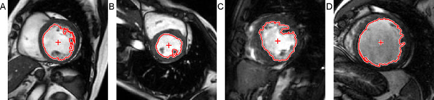

# localizeLV
Localizes cardiac LV in MRI by estimating 3D centrepoint

This MATLAB function estimates the cardiac left ventricle (LV) centre in cine MRI scans by roughly segmenting the LV bloodpool. It is meant as a first-step measure to enable subsequent fully-automated LV segmentation algorithms such as an active contour technique. This function only works for MRI short-axis steady state free precession (SSFP) images.

The following image illustrates sample results from various datasets:


The [Sunnybrook Cardiac Data (SCD)](http://www.cardiacatlas.org/studies/sunnybrook-cardiac-data/) is a good public dataset to test against. You will have to write your own DICOM sorting code to properly parse the source images into a 4D matrix.

## Usage
```
[bw4d_LV, bw3d_LV] = localizeLV(im4d, res_xy)
```
- in: `im4d` is a 4D volume with dimensions y,x,t,z
- in: `res_xy` is the x/y resolution in mm/pixel
- out: `bw4d_LV` is a 4D binary mask representing the estimated LV bloodpool
- out: `bw3d_LV` is adapted from bw4d_LV, but averaged across time

Use `bw4d_LV` or `bw3d_LV` as appropriate to determine the per-slice, per-phase, or overall mean centrepoint.

## Dependencies
This function requires MATLAB, though it should probably also work on Octave *(not tested)*. It was developed against MATLAB R2014a, and requires the **Image Processing** and **Statistics** toolboxes to be installed.

## Citation
If you use **localizeLV** in your research, please cite the article linked below, thanks. <br />
[*Tan, L.K., Liew, Y.M., Lim, E. et al. Automatic localization of the left ventricular blood pool centroid in short axis cardiac cine MR images. Med Biol Eng Comput 56, 1053–1062 (2018). https://doi.org/10.1007/s11517-017-1750-7*](https://doi.org/10.1007/s11517-017-1750-7)
